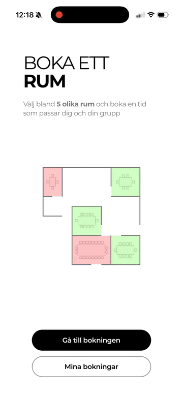

# Compileit Rooms

A meeting-room booking app built for the Compileit coding case.

## Demo

[](docs/demo.mp4)

[Full-resolution video (MP4, 2× speed)](docs/demo.mp4)

## Structure

```text
apps/mobile  React Native app with Expo
apps/api     Node.js API with TypeScript, Express, and SQLite
```

## Run the backend

```bash
cd apps/api
npm install
npm run dev
```

The API listens on port `3000` and creates `apps/api/data/rooms.db` automatically.

## Run the mobile app

Create `apps/mobile/.env` from `.env.example` and replace `YOUR_COMPUTER_IP` with the computer's local network address. A physical phone cannot use `localhost` to reach the computer.

```bash
cd apps/mobile
npm install
npx expo run:ios --device
```

After the native development build has been installed, use `npm start` for normal development.

## Booking flow

1. The app requests the room list and all bookings for the next 92 days whenever the calendar gains focus.
2. The app generates one-hour slots between 08:00 and 17:00 and removes those that have started or overlap a booking.
3. The selected room, start time, end time, and name are sent to the backend.
4. The backend rejects bookings whose start time has passed or that overlap another booking, and stores an accepted booking in SQLite.
5. The app stores the returned booking receipt and cancellation token locally with AsyncStorage.

## Assumptions

- One room is booked per booking.
- Meetings are one hour long.
- The five rooms are defined as a small constant in the Node server.
- No account is required. The cancellation token stored on the device proves ownership of a booking.
- The calendar shows 23 swipeable four-day pages (92 days including today). All pages use the same fetched booking list; swiping does not make additional requests.
- The app and local development server use the same time zone.
- "Mina bokningar" shows bookings whose end time is still in the future, including ongoing meetings. Ended bookings remain stored locally and in SQLite; they are only hidden from this view. The list refreshes when the screen gains focus.

## API

```text
GET    /rooms
GET    /bookings?startsAt=<ISO>&endsAt=<ISO>
POST   /bookings
DELETE /bookings/:id
```

SQLite contains only a `bookings` table. The backend checks overlapping time intervals in a transaction before inserting a booking.
